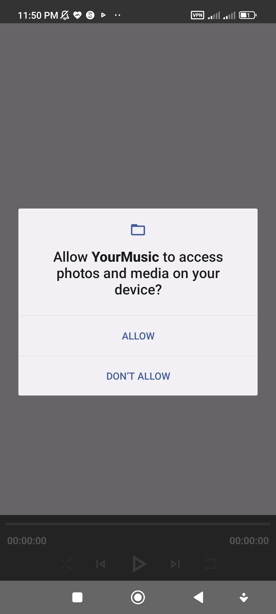

# Your Music
## Description 
This is a simple music player app which lets you browse and play sound tracks saved on your android device, it provides features like playing music in background, controlling music through notification etc.
This project along with [**GuardianNews**](https://github.com/farbodbj/GuardianNews) were the two projects I have completed as an exercise in the process of my android bootcamp.

## Stack
| Tools | Link |
| :--- | :---: |
| 🤖 Kotlin | [Kotlin](https://kotlinlang.org/) |
| 🎶 Media3 | [Loading & Playing Music](https://developer.android.com/guide/topics/media/media3) |
| 🗝️ Hilt | [DI](https://dagger.dev/hilt/) |
| 🖼️ Glide | [Loading Pictures](https://github.com/bumptech/glide) |

## Design Process
The new [**Jetpack media3**](https://developer.android.com/guide/topics/media/media3) was the core library used in this project. [**MediaStore**](https://developer.android.com/reference/android/provider/MediaStore) was used for providing an real-time access (using Flow api & kotlin coroutines) method to the music files from device storage, [**MediaSessionService**](https://developer.android.com/reference/androidx/media3/session/MediaSessionService) for managing audio playback along with media3 in-built exoplayer and media session. It was tried to keep the design scalable and robust while avoiding unnecessary complications.

## Visuals 

<table style="width:100%">
  <tr>
    <th>music list</th>
    <th>single music</th> 
    <th>permission</th>
  </tr>
  <tr>
    <td></td> 
    <td></td>
    <td></td>
  </tr>
  <tr>
    <th>notification</th>
  </tr>
  <tr>
    <td></td> 
  </tr>
</table>

## Contributing
Feel free to contribute to this project by pointing out any bugs, design flaws, updating for best practices or etc using issues or pull requests. I hope this app can be used as a reference for other learners or even be used to actually listen to some quality music :)